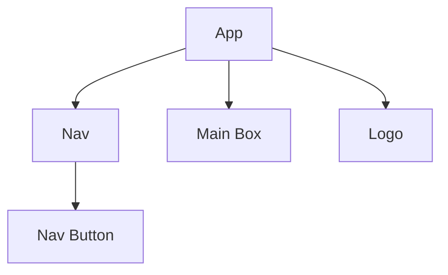

# Front End Plan
## Wireframe and component structure
### Wireframe Layout
### Components
*(Please add to this!)*

## Testing Plan
We will use Jest for unit tests, and Cypress for E2E tests.
### Unit Tests
#### Happy Path
### E2E Tests
#### Happy Path
- User can properly select video, choose color, set thresshold, and click submit
- Each of the nav buttons leads to proper route
#### Unhappy Path
#### Edge Case
