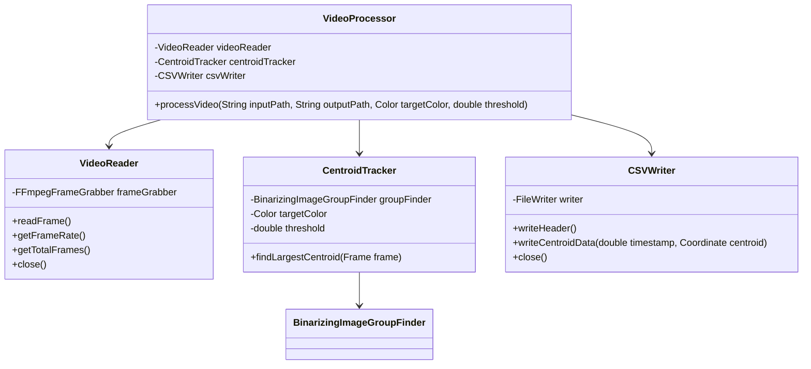

# Centroid Finder Video Processing Extension Plan

## Overview
This plan outlines the approach for extending the existing centroid finder project to process MP4 videos and generate CSV files tracking the largest centroid over time.

## Architecture

## Component Responsibilities

### 1. VideoProcessor (Main Class)
- Entry point for video processing
- Coordinates between VideoReader, CentroidTracker, and CSVWriter
- Handles command line argument parsing
- Manages the overall processing workflow

### 2. VideoReader
- Uses JavaCV's FFmpegFrameGrabber for video processing
- Provides frame-by-frame access to video
- Handles video metadata (frame rate, total frames)
- Manages video resource cleanup
- Converts frames to appropriate format for centroid processing

### 3. CentroidTracker
- Reuses existing BinarizingImageGroupFinder
- Processes individual frames to find centroids
- Identifies the largest centroid in each frame
- Returns (-1, -1) when no centroid is found
- Handles frame format conversion if needed

### 4. CSVWriter
- Handles CSV file creation and writing
- Manages proper formatting of timestamp and coordinate data
- Ensures proper resource cleanup

## Implementation Plan

### Phase 1: Core Components
1. Create VideoReader class
   - Implement frame reading using FFmpegFrameGrabber
   - Add frame rate and total frame counting
   - Add proper resource management
   - Implement frame format conversion utilities

2. Create CentroidTracker class
   - Adapt existing BinarizingImageGroupFinder for frame processing
   - Implement largest centroid selection
   - Add proper error handling for no centroid cases
   - Handle frame format conversion

3. Create CSVWriter class
   - Implement CSV file writing functionality
   - Add proper formatting for timestamp and coordinates
   - Implement resource management

### Phase 2: Integration
1. Create VideoProcessor class
   - Implement command line argument parsing
   - Create main processing loop
   - Coordinate between components
   - Add proper error handling

2. Add Maven configuration
   - Configure Maven Assembly Plugin
   - Set up JavaCV dependencies
   - Configure JAR creation

### Phase 3: Testing
1. Unit Tests
   - Test VideoReader frame extraction
   - Test CentroidTracker with sample frames
   - Test CSVWriter formatting
   - Test VideoProcessor integration

2. Integration Tests
   - Test with sample videos
   - Verify CSV output format
   - Test error handling

### Phase 4: Validation
1. Test with salamander video
   - Experiment with different color values
   - Test different threshold values
   - Verify tracking accuracy
   - Document testing results

## Dependencies
- JavaCV (org.bytedeco:javacv-platform)
- Existing centroid finder components
- Maven Assembly Plugin (for JAR creation)

## Testing Strategy
1. Unit Tests
   - Test each component in isolation
   - Mock dependencies where appropriate
   - Verify error handling

2. Integration Tests
   - Test with sample videos
   - Verify CSV output format
   - Test end-to-end processing

3. Validation Tests
   - Test with real salamander video
   - Document color and threshold selection process
   - Verify tracking accuracy

## Notes
- Will need to add JavaCV dependencies to pom.xml
- Need to ensure proper resource cleanup
- Will need to handle video format compatibility
- Should add proper error messages for invalid inputs
- May need to handle frame format conversion between JavaCV and existing image processing code 