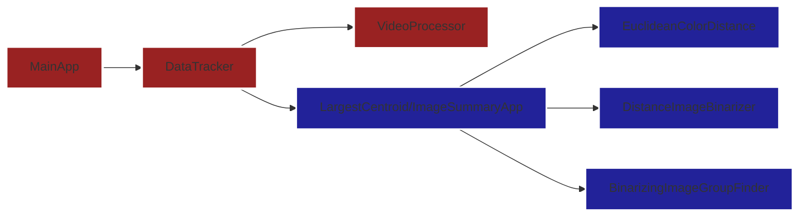
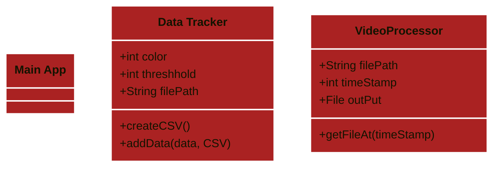

# Planning
- New entry point
    - new Main calls old main on each video frame
- (maybe?) Handle each frame as it's created
    - Consider tradeoffs of time and size
- Convert frames back into a video for validation

[new main] -> [Data Tracker - create CSV, call centroid finder to modify CSV] -> [largest centroid finder - take photo, return largest centroid] && [Video Processor - produce multiple frames] 

Link to flowchart: https://docs.google.com/drawings/d/1PYy6h4iulJ7FepGHRRITSQBkAGDCtvwggX7IKSOrPlc/edit

<!-- To view the diagram below in preview, add Markdown Preview Mermaid Support extension -->

